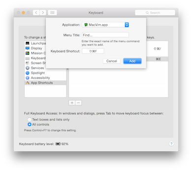
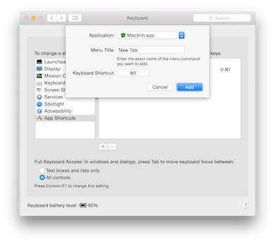

# Setting up a new dev machine

* Rename your computer
* Turn on Firewall
* Turn on FileVault
* Install 1Password
* Install XCode, accept the license agreement
* Install XCode command line tools
* Install XQuartz version of X11
* Install [Homebrew](http://brew.sh)
* Get dotfiles
* Install [Mouapp](http://mouapp.com)
* Install MacVim (via brew)
* Install [Gitx](https://github.com/rowanj/gitx/releases)
* Install caffeine (via app store)
* Install [ImageOptim](https://imageoptim.com)
* Make color invert accessibility shortcuts work
* Remap capslock
* Install crashplan
* Turn off auto-correct (System Preferences | Keyboard | Text)
* Turn up key repeat
* Screen auto-off in 5 minutes
* Karabiner: (customize everything) https://pqrs.org/osx/karabiner/document.html.en
* XCode xvim https://github.com/XVimProject/XVim/blob/master/INSTALL_Xcode8.md
* Insomnia - https://insomnia.rest/download/#mac

## 1Password?

When running 1Password for the first time you'll need to get it setup with another device. You can do this via iCloud but you must have iCloud Drive setup or you will receive an iCloud Error. 

Instead you can simply run a backup on your other device and transfer the backup to your new computer and start from there.

## Mail

When you setup your Mail you'll want to create an [application specific password](https://security.google.com/settings/security/apppasswords).

## Install XCode command line tools

Run this:

    xcode-select --install

Click "install" on the popup.

## Install XQuartz version of X11

Find the latest release for your operating system: [https://xquartz.macosforge.org/trac/wiki/Releases](https://xquartz.macosforge.org/trac/wiki/Releases)

## Install Homebrew

Homebrew is "The missing package manager for OSX". It allows you to quickly compile and install binaries.

    ruby -e "$(curl -fsSL https://raw.githubusercontent.com/Homebrew/install/master/install)"

Once you have installed brew, 

    brew doctor
    
## Install git bash completions

    brew install git bash-completion

## Get Solarized

Make a link for Terminal:

    ln -s /Applications/Utilities/Terminal.app /Applications/Terminal.app

Solarized is an awesome color scheme you will like. There is a [terminal version](https://github.com/tamul/solarized-osx-terminal-colors):

    cd ~
    mkdir -p Examples
    cd Examples
    git clone https://github.com/tamul/solarized-osx-terminal-colors.git
    open solarized-osx-terminal-colors
    
Once the `Finder` window opens you should double click on the Terminal items in the `xterm-256color` color folder. Once you have opened these the themes are added to Terminal.app. Open the Preferences and choose the one you want and set it as default.

Once you have completed the install of the themes you can delete the created folder.

## Setup an ssh key

    brew install openssl    
    
Follow [Github's Advice](https://help.github.com/articles/generating-ssh-keys). 

    ssh-keygen -t rsa -C "your_email@example.com"

Use 1Password to generate a password for the passphrase.

    eval `ssh-agent -s`
    ssh-add ~/.ssh/id_rsa
    
Add that password to your [Github account](https://github.com/settings/ssh):

    pbcopy < ~/.ssh/id_rsa.pub
    
Test the key:

    ssh -T git@github.com

> Hi jeffrafter! You've successfully authenticated, but GitHub does not provide shell access.

## Setup Ruby

    brew update
    brew install rbenv ruby-build
    
Afterwards you'll still need to add `eval "$(rbenv init -)"` to your profile as stated in the caveats. You'll only ever have to do this once.

    rbenv install -l
    rbenv install 2.1.5
    rbenv rehash
    
When you install gems with binstubs you will need to rehash.

You can change your global ruby as well:

    rbenv global 2.1.5

## Dotfiles

Setting up the your `~/.*` directory quickly makes your life better.

    curl -fsSL https://raw.github.com/jeffrafter/dotfiles/master/script/bootstrap | sh
    
Once you have done that you'll want to run the bootstrap:

    cd ~/.dotfiles
    script/bootstrap
    
This is going to ask for sudo permission because some of the OSX config settings require sudo (which is generally a no-no). You can adjust the script if needed.   
    
Update the vim submodules:

    cd ~/.vim/bundle
    git submodule init
    git submodule update
    
You can use CtrlP to instead of command-t. It installs a bit manually:

    cd ~/.vim
    git clone https://github.com/kien/ctrlp.vim.git bundle/ctrlp.vim    
    
    
If you are using Command-T you might have trouble with the C extension of Command-T because of the ruby version used to compile it:

    cd ~/.vim/bundle/command-t/ruby/command-t
    ruby extconf.rb
    make    
    
## Installing MacVim

You should install MacVim via Homebrew:

    brew install macvim

Replace the icons:

     sudo cp ~/.dotfiles/resources/MacVim.icns /Applications/MacVim.app/Contents/Resources/
    
     sudo cp ~/.dotfiles/resources/caffeine/*.png /Applications/Caffeine.app/Contents/Resources/

Something about a cooler icon [https://github.com/thilko/vim_config/blob/master/integrate_way_cooler_icon](https://github.com/thilko/vim_config/blob/master/integrate_way_cooler_icon):
    
    
    MACVIM_TARGET=$(find /usr/local/Cellar -name MacVim.app 2> /dev/null | sort | tail -n 1)
    MACVIM_PATH="$MACVIM_TARGET/Contents/Resources/"
    cp ~/.dotfiles/resources/MacVim.icns $MACVIM_PATH
    
## Make a shortcut for iOS similator

You know you want it:
    
    ln -s /Avpplications/Xcode.app/Contents/Applications/iPhone\ Simulator.app /Applications/iOS\ Simulator.app

## Other things to brew

    brew install wget
    brew install imagemagick
    brew install ghostscript
    brew install gh

## Install Pow (optional)

Go to the website: [http://pow.cx/manual.html#section_1](http://pow.cx/manual.html#section_1)

    curl get.pow.cx | sh
    
Once you have that you'll need to symlink the current folder to pow.

    cd ~/.pow
    ln -s ~/Projects/myapp
    
## Install nginx (optional)

You can install `nginx` via `brew`:

    brew install nginx
    
Once you have `nginx` you can start it with `sudo nginx` or boot it at startup. Make sure your firewall is blocking incoming port 80 so that people outside of your computer cannot see your running application by typing in your local IP address.

You'll want to setup your Nginx config in `/usr/local/etc/nginx/nginx.conf`:

    worker_processes  1;

    error_log  /usr/local/var/log/nginx.error.log;

    events {
        worker_connections  1024;
    }

    http {
        include       mime.types;
        default_type  application/octet-stream;
        sendfile        on;
        keepalive_timeout  65;
        access_log  /usr/local/var/log/nginx.access.log;

        upstream rails {
          server 127.0.0.1:3000;
        }

        upstream nodejs {
          server 127.0.0.1:3700;
        }

        # Any server configuration goes here

    }

For each project you will need to add a `server` declaration. For example, if you are just serving a static page, add the following:

        # Serving a static website
        
        server {
          listen 80;
          server_name static.dev;
          root /Users/username/Projects/static;
          try_files $uri/index.html $uri.html $uri;
          index index.html;
          location / {
          }
        }

If you are serving a Ruby on Rails website:

        # Serving a Ruby on Rails website
        
        server {
          listen 80;
          server_name rails.dev;
          root /Users/username/Projects/rails_root;

          client_body_in_file_only clean;
          client_body_buffer_size 32K;
          client_max_body_size 100M;
          sendfile on;
          send_timeout 300s;

          index        index.html index.htm;

          try_files  $uri/index.html $uri.html $uri @rails;

          location @rails {
            proxy_set_header  X-Real-IP        $remote_addr;
            proxy_set_header  X-Forwarded-For  $proxy_add_x_forwarded_for;
            proxy_set_header  Host             $http_host;
            proxy_redirect    off;
            proxy_pass        http://rails;
          }
          error_page   500 502 503 504  /50x.html;
        }

If you are serving a Node.js website it is very similar to Rails:

        # Serving a Node.js website
       
        server {
          listen 80;
          server_name nodejs.dev;
          root /dev/null;
          location / {
            proxy_set_header  X-Real-IP        $remote_addr;
            proxy_set_header  X-Forwarded-For  $proxy_add_x_forwarded_for;
            proxy_set_header  Host             $http_host;
            proxy_set_header  Upgrade          $http_upgrade;
            proxy_set_header  Connection       "upgrade";
            proxy_redirect    off;
            proxy_pass        http://nodejs;
          }
        }

    
## Install Postgres

    brew install postgresql
    brew info postgresql
    ln -sfv /usr/local/opt/postgresql/*.plist ~/Library/LaunchAgents
    launchctl load ~/Library/LaunchAgents/homebrew.mxcl.postgresql.plist
    
    createdb `whoami`
    psql
    \q
    
## Install redis

    brew install redis
    ln -sfv /usr/local/opt/redis/*.plist ~/Library/LaunchAgents
    launchctl load ~/Library/LaunchAgents/homebrew.mxcl.redis.plist
        
## Make Safari show the full web address

You want to see the whole URL while you develop. But that is "advanced". Go to `Safari Preferences`, `Advanced`, and check `Show full website address`. [More info](http://osxdaily.com/2014/10/20/show-full-website-url-address-safari-mac-os-x/)

# Fix osx to make it secure

[https://fix-macosx.com](https://fix-macosx.com)

# Shortcuts

Open `System Preferences` go to `Keyboard` and click on `Shortcuts`. Once there, click on `App Shortcuts` and then you can click the plus icon to add a shortcut. 

